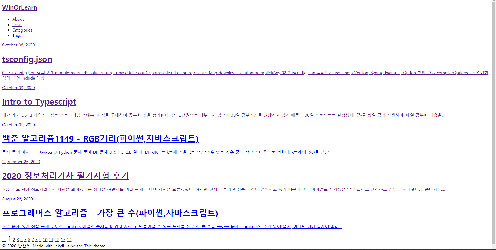

* TOC 
{:toc}

---

## 개요

- 블로그에 글을 작성한 후 업로드를 확인하려고 접속했는데, 당황스러운 상황에 직면했다.
  
- 이전에 정상작동하는 것을 확인한 후 `_config.yml`을 수정한 적이 없는데 스타일이 깨져있었다.
- `F12`를 누르고 콘솔창을 띄워보니 스타일 파일인 `main.css`가 404 에러로 로드되지 않고 있었다.

## 원인

- 몇 개의 링크를 검사해보고 url을 확인해보니 url 생성이 이전과 다르게 오류가 발생하는 것을 확인했다.
- 또한 웹서핑을 통해 유사한 문제를 겪은 게시글들을 확인했고, `baseurl`의 경로지정 오류로 인해 파일이 로드되지 않는다는 것을 확인했다.

## 해결

- `_config.yml`의 `baseurl`과 `url`을 실제 파일이 로드되는 루트 경로로 수정했다.
- css 파일을 로드하는 `head.html`의 경로를 수정했다.
- 위 2가지 사항을 체크하고 업데이트하자 문제없이 css가 로드되는 것을 확인했다.
